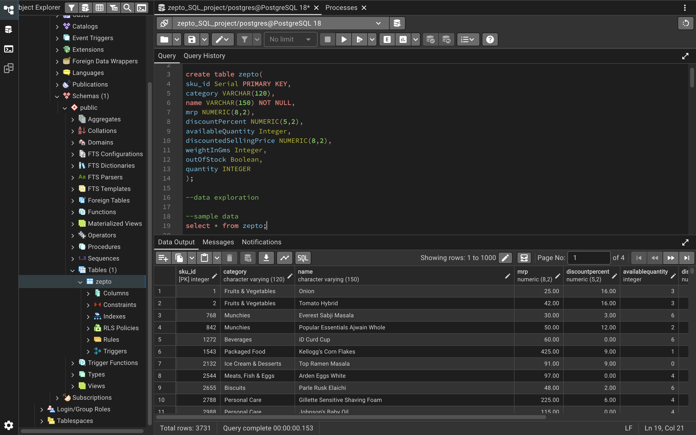
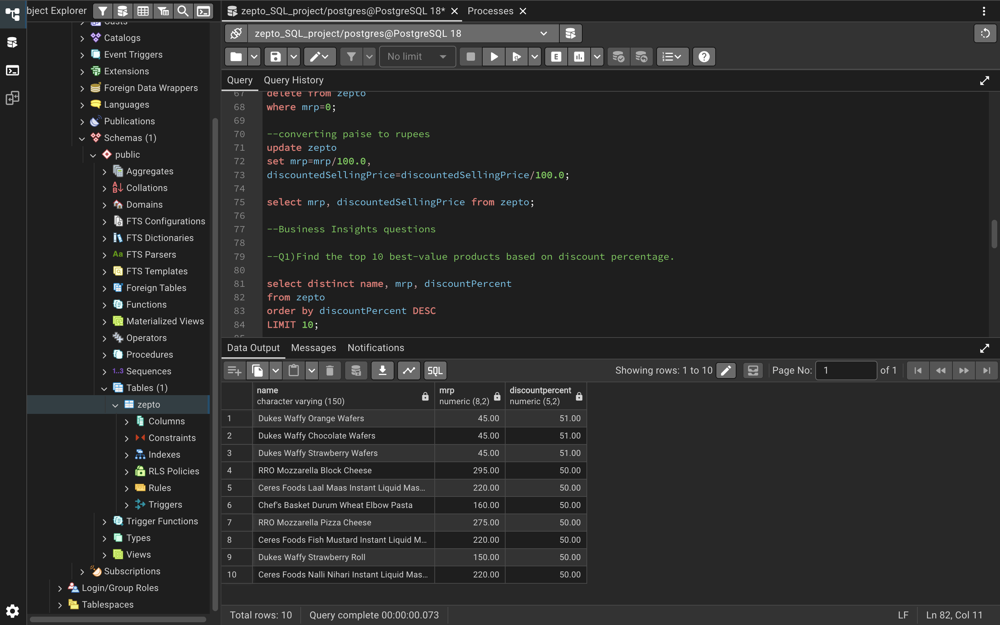
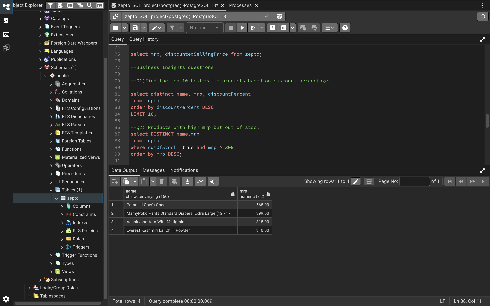
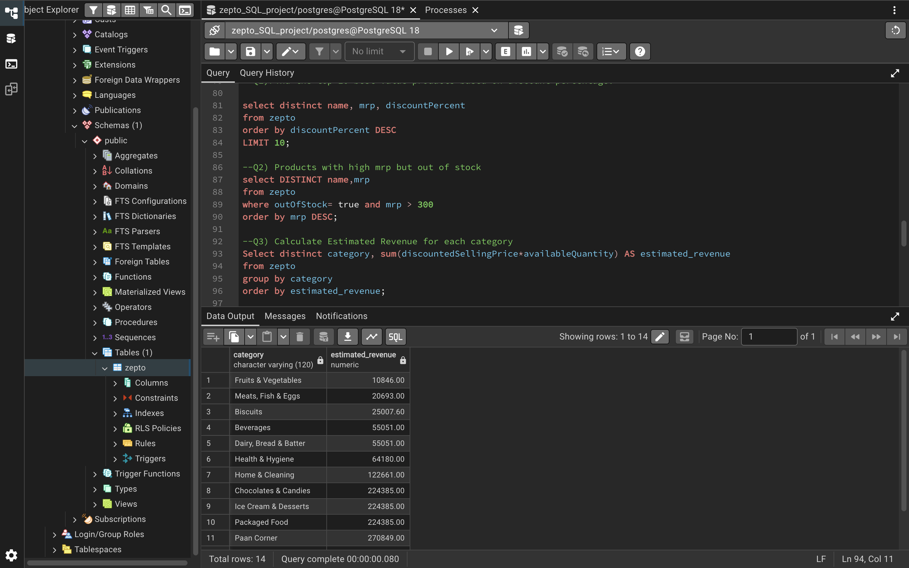
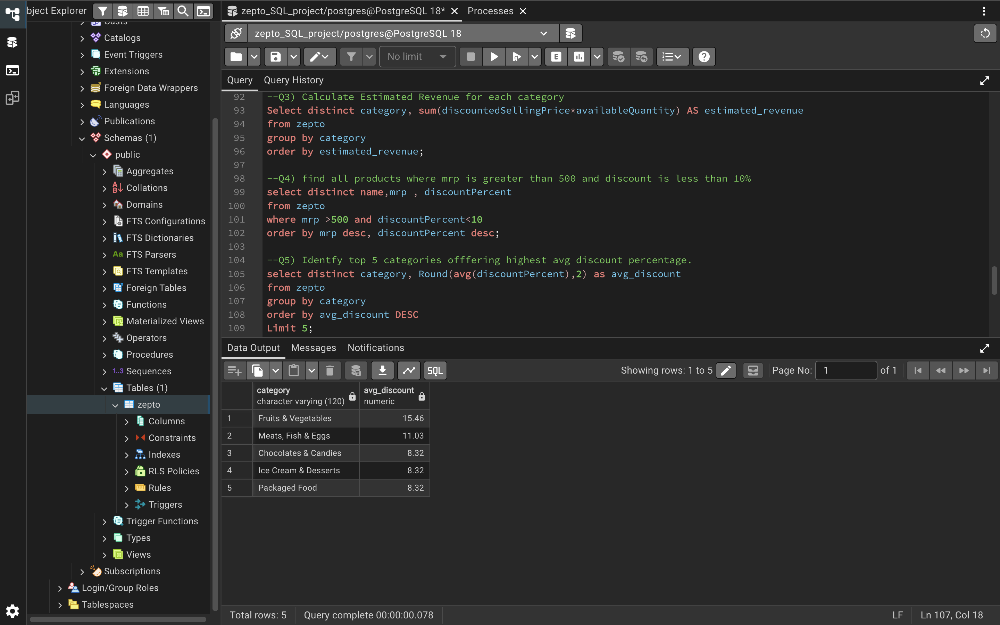
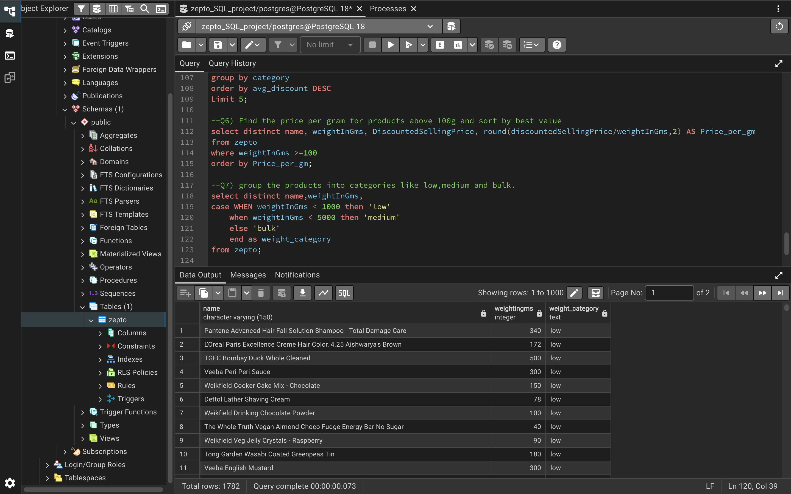

# 🛒 Zepto E-Commerce SQL Data Analysis

## 📌 Project Overview

This project analyzes Zepto e-commerce inventory data using SQL and PostgreSQL. The analysis focuses on product pricing, discounts, inventory availability, product categories, and potential business insights.

The project follows a complete SQL data analysis workflow, including database and table creation, data import, exploratory data analysis, data cleaning, and business-focused analysis.

The dataset contains 3,732 product records.

---

## 🎯 Business Objectives

The main objectives of this project are to:

- Analyze Zepto's product inventory
- Understand product pricing and discount patterns
- Identify products with high discounts
- Analyze stock availability
- Compare products across different categories
- Estimate potential revenue
- Identify value-for-money products
- Generate useful business insights using SQL

---

## 📁 Dataset Overview

The dataset used in this project was sourced from Kaggle and is based on Zepto's e-commerce inventory data.

The dataset contains 3,732 product records. Each row represents a product/SKU entry and contains information related to pricing, discounts, inventory, weight, and stock availability.

### Data Source

[Kaggle – Zepto Inventory Dataset](https://www.kaggle.com/datasets/palvinder2006/zepto-inventory-dataset)

### Key Columns

| Column | Description |
|---|---|
| `sku_id` | Unique product identifier generated using PostgreSQL SERIAL |
| `category` | Product category |
| `name` | Product name |
| `mrp` | Maximum Retail Price |
| `discountPercent` | Discount percentage |
| `availableQuantity` | Quantity available in inventory |
| `discountedSellingPrice` | Selling price after discount |
| `weightInGms` | Product weight in grams |
| `outOfStock` | Indicates whether the product is out of stock |
| `quantity` | Quantity/unit information |

---

## 🔧 Project Workflow

### 1. Database & Table Creation

Created a PostgreSQL table named `zepto` with appropriate data types for each column.

The `sku_id` column was created as a `SERIAL PRIMARY KEY` so that unique SKU IDs are automatically generated during data import.

### 2. Data Import

The dataset was imported into PostgreSQL using the `\copy` command.

A total of **3,732 records** were successfully imported.

### 3. 🔍 Data Exploration

Explored the dataset to understand its structure and identify important patterns.

The analysis included:

- Counting the total number of records
- Viewing sample records
- Identifying unique product categories
- Checking for NULL values
- Analyzing in-stock and out-of-stock products
- Identifying duplicate product names

### 4. 🧹 Data Cleaning

Performed data-quality checks before conducting the business analysis.

This included:

- Checking for missing values
- Identifying invalid pricing values
- Reviewing duplicate products
- Checking product availability
- Preparing pricing data for analysis

### 5. 📊 Business Analysis

SQL queries were used to answer business-oriented questions such as:

- Which products offer the highest discounts?
- Which expensive products are currently out of stock?
- Which categories have the highest average discounts?
- What is the potential revenue by product category?
- Which products provide better value based on price and weight?
- How is inventory distributed across categories?
- Which products have high MRP but minimal discounts?

---

## 🧠 SQL Concepts Used

This project uses several SQL concepts, including:

- `SELECT`
- `WHERE`
- `DISTINCT`
- `GROUP BY`
- `ORDER BY`
- `COUNT()`
- `SUM()`
- `AVG()`
- Aggregate Functions
- `CASE`
- NULL handling
- Filtering
- Sorting
- Data Cleaning

---

## 🛠️ Tools & Technologies

- **PostgreSQL**
- **pgAdmin 4**
- **SQL**
- **Excel / CSV**
- **GitHub**

---

## 📁 Project Files

```text
zepto-sql-data-analysis/
│
├── README.md
├── Zepto_SQL_Analysis.sql
└── zepto_v2_import.csv
```

## 📸 Project Screenshots

### Total Records


### High Discount Products


### High MRP Products That Are Out of Stock


### Revenue by Category


### Top Categories by Average Discount


### Weight Classification

